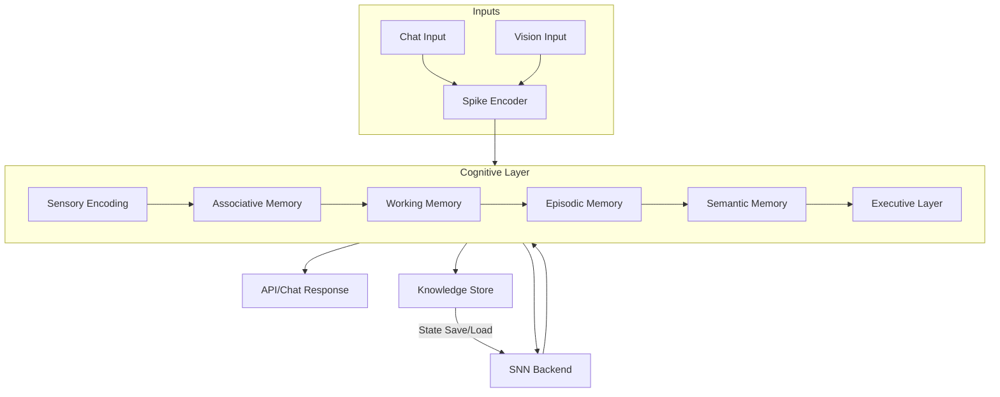

# HASN Architecture (Unified, Integrated)

## 1. Cognitive Layer Structure

The cognitive layer is the **hierarchical control plane** sitting on top of the raw spiking network (SNN). Its job is to transform low-level spike activity into structured, human-like cognition.

**Layers:**

1. **Sensory Encoding Layer**  
   - Converts input modalities (text tokens, pixels, audio spectrograms, sensor data) into spiking patterns.  
   - Uses sparse encodings and Poisson spike generators.  
   - Supports modality adapters (Text, Vision, Audio, Telemetry) with unified spike interface.

2. **Associative Memory Layer**  
   - Implements Hebbian/STDP rules for linking co-active concepts.  
   - Responsible for fast pattern completion and similarity matching.  
   - Keeps sparse, bounded synapses with homeostatic normalization.

3. **Working Memory Layer**  
   - Small-capacity, high-plasticity neurons for temporary storage (short-term context).  
   - Decays naturally without consolidation (leaky integrators + refractory).  
   - Session-scoped buffers (per chat/interaction) with TTL.

4. **Episodic / Semantic Memory Layer**  
   - **Episodic memory:** spike patterns tagged with temporal/causal context (who/what/when/why).  
   - **Semantic memory:** consolidated associations compressed over time (generalization).  
   - Controlled by a consolidation scheduler (time + significance + reward/surprise gating).

5. **Executive Layer**  
   - Gating, attention, and arbitration between memory layers.  
   - Decides which memory trace is surfaced to API / user.  
   - Hosts meta-learning signals (surprise, reward modulation, homeostasis) and policy knobs (precision/recall).

---

## 2. SNN Backend

The backend is where spikes and synapses are simulated. The current Python loop-based implementation should be upgraded for performance and scale.

**Backend Options:**
- **Brian2 (CPU, event-driven, easy prototyping)**  
- **Norse (PyTorch + GPU kernels)** – **recommended** for scaling and compatibility with deep learning tooling.  
- **Intel Lava / Loihi** – neuromorphic hardware path (long-term).  
- **Custom NumPy/Numba engine** – short-term, pragmatic, until migration is complete.

**Design Principle:**  
Keep the cognitive layer API **backend-agnostic** via a thin interface:

```python
class BrainBackend:
    def step(self, inputs): ...
    def get_state(self): ...
    def set_state(self, state): ...
```

**Performance Notes:**
- Prefer event-driven simulation + sparse matrices (CSR/COO) over dense loops.  
- Vectorize inner loops; enable optional Numba/JAX acceleration.  
- Determinism controls: fixed RNG seeds, bounded weights/membranes, reproducible kernels.

**Lessons from prior analyses:**  
- Earlier experiments contrasted **static brain networks (SBNs)** with **cognitive brain networks (CBNs)**.  
- The SBN design was simpler but limited in adaptability.  
- The CBN design, retained here, supports episodic/semantic layering and continual learning.  
- This choice is documented in ADR-0001 (superseding `DYNAMIC_VS_STATIC_TRAINING_ANALYSIS.md`).

---

## 3. STRIDE Analysis (Threat Modeling)

| Category | Threat | Risk | Mitigation |
|---|---|---|---|
| **S – Spoofing** | Fake API clients; forged training jobs | Medium | API key/JWT; optional mTLS; client fingerprinting; per-route auth scopes |
| **T – Tampering** | Manipulation of saved brain snapshots or training data | High | SHA-256 integrity hashes; signed snapshots; WORM/immutability on storage; versioned state with rollback |
| **R – Repudiation** | No audit trail of training/inference actions | Medium | Append-only logs; request IDs; provenance metadata (who/when/source); optional ledger (blob immutability) |
| **I – Information Disclosure** | Leakage of sensitive data via continuous training or responses | High | Ingestion allowlist; robots.txt respect; PII/NSFW filters; redaction; quarantine before consolidation; differential access to memory |
| **D – Denial of Service** | Overloading SNN with high-rate inputs; expensive queries | High | Rate limiting (token bucket/Redis); per-session quotas; backpressure; bounded batch sizes; circuit breakers |
| **E – Elevation of Privilege** | Gaining admin on brain state or trainer | High | RBAC; split roles (inference vs training); signed jobs; least privilege for storage; isolated namespaces; secrets in vault |

**Operational Security:**  
- Tighten CORS; prefer private ingress in production.  
- Encrypt at rest (storage) and in transit (TLS).  
- Regular snapshot integrity checks + restore drills.

---

## 4. Continuous Training (Design & Execution)

**Goals:** continually adapt without catastrophic forgetting or unsafe data drift.

**Pipeline:**  
1. **Ingestion** — Inputs arrive via API (chat/vision) or curated crawlers.  
2. **Quarantine Buffer** — Stage raw data and preliminary spikes in a sandbox store.  
3. **Screening** — Deduplicate (URL+content hash), check licensing, respect robots.txt; PII/NSFW heuristics; domain allowlist.  
4. **Lightweight Spike Replay** — Apply Hebbian/STDP in a temporary working context; cap updates and apply homeostasis.  
5. **Significance Scoring** — Novelty, frequency, reward/surprise; only promote if above threshold.  
6. **Consolidation** — Merge into episodic → semantic stores; decay/normalize weights to avoid runaway growth.  
7. **Snapshot & Rollback** — Periodic signed snapshots; keep N latest; support manual/automatic rollback.  
8. **Evaluation Loop** — Regression tasks (pattern completion, recall@k), drift monitors, and safety checks prior to promotion to production state.

**Plumbing & Orchestration:**  
- **Queues:** Redis, Kafka, or NATS JetStream for ingestion and trainer work items.  
- **Schedulers:** Temporal/K8s CronJobs for replay/consolidation windows.  
- **Stores:** Quarantine (object storage); Approved memory (JSON snapshots + vector DB); Metrics (TSDB).  
- **Observability:** Spike raster capture, synaptic delta histograms, latency/throughput dashboards.

**Safety & Governance:**  
- Human-in-the-loop approval for sensitive domains.  
- Data retention policy; right-to-forget hooks to prune episodic/semantic traces.  
- Explainability endpoints to inspect traces contributing to outputs.

**Lessons from `REAL_WORLD_EXPERIENCE_SOLUTION.md`:**  
- **Experience replay** is used to reinforce sequences of events (episodic traces).  
- **Novelty filters** (frequency and diversity checks) prevent oversaturation of memory with redundant inputs.  
- **Human feedback** can be injected at replay stage to guide consolidation.  
- **Storage efficiency** is achieved by hashing content, compressing redundant associations, and pruning aged traces.  

---

## 5. Deployment Methods

**Local Development**  
- Docker Compose: FastAPI + SNN backend + Redis.  
- Small brain size; hot-reload for APIs; unit/integration tests.

**Edge Deployment**  
- Raspberry Pi 5 / Jetson Orin; Norse/PyTorch backend; optional GPU.  
- On-device inference; limited continual learning (rate-capped).  
- Periodic sync of semantic state from cloud (distilled snapshots).

**Cloud Deployment**  
- Kubernetes (AKS/GKE/EKS):  
  - **Frontend:** FastAPI Deployments with HPA.  
  - **Backend:** SNN StatefulSets (GPU nodes for Norse).  
  - **Queues:** Redis/Kafka operators.  
  - **Storage:** Object store for snapshots; vector DB (Qdrant/Azure AI Search) for semantic indices.  
  - **Security:** Private ingress, mTLS (service mesh optional), Key Vault/Secrets Manager.

**Hybrid**  
- Train large models in cloud; push distilled/compressed state to edge.  
- Edge devices collect episodes; sync back for consolidation.

**Release Strategy**  
- Canary brains: traffic-split between current and candidate states.  
- Rollback via snapshot version pinning.  
- Policy gates for safety and performance SLOs.

---

## 6. Interaction & Knowledge Store

### 6.1 Chat Interaction

- Endpoint `/chat`: text → spike encoder → cognitive layer → response.  
- Session-scoped working memory with TTL; configurable context window.  
- Retrieval: episodic/semantic recall via spike similarity + (optional) embedding bridge.  
- Controls: temperature/precision, recall depth, safety filters.  
- Telemetry: per-turn provenance (which traces contributed).  

**Integrated from `NEURAL_RESPONSE_SOLUTION.md`:**  
- Neural responses are not just text outputs but emerge from **mapping active spike traces → symbolic tokens**.  
- The neural response generator:  
  1. Monitors active assemblies in working/episodic memory.  
  2. Matches them to symbolic representations (tokens or phrases).  
  3. Surfaces candidate responses ranked by semantic similarity and episodic relevance.  
- **Safety layer:** responses are filtered to avoid disclosure of raw episodic traces unless explicitly allowed.  
- This improves explainability: responses can be traced back to contributing spike assemblies.

### 6.2 Vision Interaction

- Images → encoder (e.g., CLIP/DINOv2 embeddings) → spike encoding.  
- Multimodal associations: link visual concepts with text traces.  
- Tasks: grounding, captioning, retrieval-augmented reasoning through associative/episodic memory.

### 6.3 Knowledge Store

- **Three-tier memory:**  
  1) **Working memory** — session-local, fast decay.  
  2) **Episodic memory** — timestamped events with provenance.  
  3) **Semantic memory** — compressed/generalized associations.  
- **Persistence:** JSON snapshots via BrainSerializer; semantic index in Qdrant/Azure AI Search for hybrid retrieval.  
- **Right-to-Forget:** cascade deletes from semantic to episodic to working memory; snapshot re-issuance.  

**Lessons from `NETWORK_COMPARISON_ANALYSIS.md`:**  
- Earlier “Advanced Brain” experiments merged episodic + semantic memory into one layer.  
- This caused **catastrophic interference**.  
- Current architecture keeps them distinct — proven more stable in internal experiments.  

---

## 7. High‑Level Diagram



---

## Changelog Integration

- **Quick Start/API usage** (from `COMPLETE_SOLUTION.md`) is now in `docs/getting-started.md`.  
- **Bugfix notes** (e.g., `ARRAY_COMPARISON_FIX.md`) are archived in `CHANGELOG.md`.  
- Architecture doc remains **conceptual and structural**, while operational notes live in ADRs and changelogs.

---

# 🏭 Production Readiness Extension (Appended on 2025-09-07)

The following requirements extend the HASN architecture to make it **production ready**:

- **Stability & Learning**: bounded dynamics, homeostasis, plasticity caps per window.  
- **Determinism**: single RNG façade, fixed update order, golden master raster/weight checksums.  
- **Performance Targets**: P95 ≤ 10ms (CPU), ≤ 2ms (GPU), ≥1e6 spikes/sec/core. Perf CI enforces thresholds.  
- **Security & Governance**: signed snapshots, right-to-forget cascade, AuditEvents on all state changes.  
- **Observability**: Prometheus metrics (spikes, updates, recall@k, drift), `/inspect/spikes` raster export, Grafana dashboards with alerts.  
- **Portability**: snapshot schema versioning, migration with dry-run + checksum diff.  
- **SLOs**: availability 99.5%, chat latency P50 ≤ 150ms / P95 ≤ 400ms, drift bounded vs 7-day baseline, recovery ≤ 10 min cold / ≤ 60s warm.  
- **Release Safety**: canary by snapshot version, rollback by pinning.

This section should be used as a **reference standard** for reviews, CI, and SRE runbooks.
